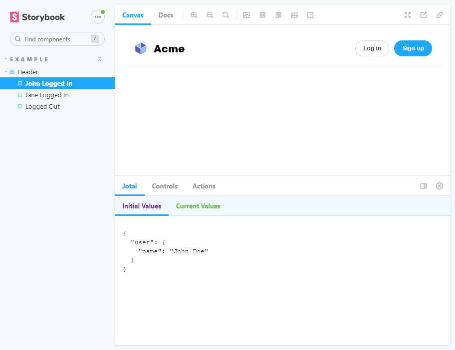

# Storybook Jotai Addon

A [Storybook](https://storybook.js.org/) Addon and Decorator for [Jotai](https://jotai.org) and track the state in a Panel.

If you want to setup `parameters` to be strongly typed, see [@alexgorbatchev/storybook-parameters](https://github.com/alexgorbatchev/storybook-parameters).



## Install

```sh
yarn add -D @alexgorbatchev/storybook-addon-jotai
```

Register the addon in `.storybook/main.js`

```ts
module.exports = {
  stories: ['../stories/**/*.stories.tsx'],
  addons: ['@alexgorbatchev/storybook-addon-jotai'],
};
```

## Important

Please keep in mind that the addon wraps everything with `Provider` from `jotai` package. It's important
that your story components don't include the `Provider`, otherwise the addon won't be able to see and set
atom values.

## Usage

Given a simple component:

```tsx
import { useAtom, atom } from 'jotai';

const userAtom = atom(null);

export const Header = () => {
  const [user] = useAtom(userAtom);

  return (
    <div>
      {user ? (
        <div>
          <div>{`Logged in as ${user.name}`}</div>
          <Button size="small" label="Log out" onClick={() => setUser(null)} />
        </div>
      ) : (
        <div>
          <div>No one is signed in</div>
          <Button size="small" label="Log in" onClick={() => setUser({ name: 'John' })}/>
        </div>
      )}
    </div>
  );
};
```

You can write a story as

```tsx
import { atomsForStorybook } from '@alexgorbatchev/storybook-addon-jotai';
import { ComponentMeta, ComponentStoryObj } from '@storybook/react';

import { User, userAtom } from './User';

type Story = ComponentStoryObj<typeof Header>;

const meta: : ComponentMeta<typeof Header> = {
  title: 'User',
  component: User,
};

export default meta;

export const JohnLoggedIn: Story = {
  parameters: {
    jotai: atomsForStorybook({
      atoms: {
        user: userAtom,
      },
      values: {
        user: {
          name: 'John Doe',
        },
      },
    }),
  },
};

export const JaneLoggedIn: Story = {
  parameters: {
    jotai: atomsForStorybook({
      atoms: {
        user: userAtom,
      },
      values: {
        user: {
          name: 'Jane Doe',
        },
      },
    }),
  };
};

export const LoggedOut: Story = {};
```

Strongly typed example:

```tsx
import { ComponentMeta, ComponentStoryObj } from '@alexgorbatchev/storybook-parameters';
import { JotaiParameters } from '@alexgorbatchev/storybook-addon-jotai';

import { User, userAtom } from './User';

interface StoryParameters extends JotaiParameters {}

const Header = () => <div>Header</div>;

type Story = ComponentStoryObj<typeof Header, StoryParameters>;

const meta: ComponentMeta<typeof Header, StoryParameters> = {
  title: 'Header',
  component: Header,
};

export default meta;

export const JohnLoggedIn: Story = {
  parameters: {
    // `jotai` is strongly typed
    jotai: atomsForStorybook({
      atoms: {
        user: userAtom,
      },
      values: {
        user: {
          name: 'Jane Doe',
        },
      },
    }),
  },
};
```

### Development scripts

- `yarn start` runs babel in watch mode and starts Storybook
- `yarn build` build and package your addon code
